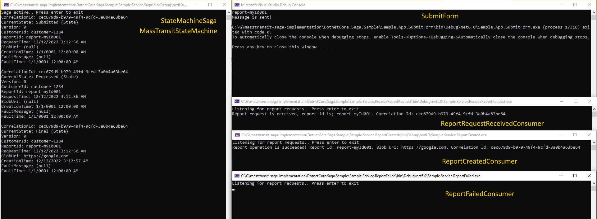

# Saga State Machine Implementation with Masstransit

- Run `docker-compose up -d` to start RabbitMQ instance.

- Start `Sample.Service.Saga` console application to manage transaction state.

- Start `Sample.App.SubmitForm` console application to send `IReportRequestCommand`.

- Start `Sample.Service.ReportCreated` and `Sample.Service.ReportFailed` console applications to consume request results. 

- Consume the `IReportRequestCommand` command via `Sample.Service.ReceiveReportRequest` and handle the report request.
    
    - If request is valid, create `IReportCreatedEvent` and produce it!
    
    - If request is invalid, create `IReportFailedEvent` and produce it!

